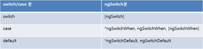

### 9.4 속성지시자
#### 9.4.1 ngClass
- css의 클래스이름을 더하거나 해제하는 지시자

```
<button [ngClass]="myClass"></button>
```
#### 9.4.2 ngStyle
- css스타일 속성과 값을 이용해 스타일을 바인딩하는 지시자

```
<div [ngStyle] = "{'font-style' : 'normal'}"></div>
```

### 9.5 구조지시자
#### 9.5.1 ngIf
- 엘리먼트를 보이거나 숨기는 역할을 하는 지시자
- 참이면 보여주고 거짓이면 숨긴다.

```
<div *ngIf=상태></div>
<div template="ngIf 상태"></div>
<template [ngIf]="상태"><div></div></template>
```

#### 9.5.2 ngSwitch
- 조건에 부합하는 엘리먼트만 선택해 DOM에 포함



```
<p [ngSwitch]="grade">
    <template ngSwitchCase="null">...</template>
    <template [ngSwitchCase] = "'admin'">...</template>
    <template [ngSwitchCase] = "'member'">...</template>
    <template ngSwitchDefault>...</template>
</p>
```

#### 9.5.3 ngFor
- 입력받은 컬렉션 변수를 템플릿 상에 반복 출력하는 기능을 포함

```
    <div *ngFor="let item of items; let i = index">
        {{i}} | {{item.title}}
    </div>
```

### 9.6 템플릿 태그
#### 9.6.1 템플릿 태그의 축약 표현
- '*' 기호는 템플릿 태그를 축약해서 표현한다는 의미
- '*' 를 사용하지 않으면 템플릿 태그를 추가해서 사용해야함

```
    <template ngFor let item [ngForOf]="items"; let-i = index">
        {{i}} | {{item.title}}
    </template>

    <div *ngFor="let item of items; let i = index">
        {{i}} | {{item.title}}
    </div>
```

#### 9.6.2 템플릿 입력변수
- ngFor 구조 지시자에 정의되는 변수로 ngFor 스코프 내에서만 사용할 수 있음
- 일반적인 for문 안에서만 사용하는 변수를 말합니다. ex) for(int i=0;i<10;i++) 에서 i를 말함

#### 9.6.3 템플릿 참조변수
- 템플릿 참조변수는 템플릿 내에서 정의할 수 있는 변수.
다음과 같은 형태로 정의
<input #템플릿 변수명>

<input #num1 type="number" value="{{init.num1}}" (input)="0">

템플릿 참조변수는 접두사 ref를 이용해 선언할 수 있음
<input ref-number1 type="number" value="{{init.num1}}" (input)="0">

템플릿 참조변수는 템플릿 내부에 선언하기 때문에 컴포넌트 클래스에 영향을 주지 않음

특정 엘리먼트의 상태를 참조하기 위해 ngModel을 이용하지 않아도 되는 장점ㅇ ㅣ있기 때문에
엘리먼트간에 간단한 상태 전달이 필요한 경우에 이용 할 수 있음.

### 10.1 선언형 프로그래밍과 지시자
#### 10.1.1 명령형 프로그래밍

명령형 프로그래밍은 언어 해석이 순차적이며 문제 해결방법에 관심이 있음
int i = 4;
int j = 5;
float f = i/j;

f가 결정되려면 i의 변수와 j의 변수의 샅애가 결정되어야함.

#### 10.1.2 선언형 프로그래밍

선언형 프로그래밍은 문제해결보다 무엇을 나타내야 할 지에 대해 관심이 많음.
선언형 프로그래밍의 예는 <html>

<html>은 구성요서의 배치가 순차적이지 않고 자유로우며 문제의 정답이 하나만 있지 않음.

#angular를 이용한 선언형 프로그래밍
Angular는 선언형 프로그래밍 방식으로 개발. -> 지시자를 좀 더 적극적으로 사용해서 개발한다는 의미.

<picture-title title="사진보기 애플리케이션"> </picture-title>
<div class="btn-group">
    <button rotate-picture degree="180"></button rotate-picture>
    <button change-size [size] = "big"><button change-size/>
</div>

애플리케이션의 기능이 무엇이고 어떤 순서로 배치되는지에 대한 정보를 얻을 수 있음.
배치가 부자연스럽다면 언제든지 순서에 영향을 받지 않고 엘리먼트를 재배치 할 수 있음.

#### 10.1.3 지시자의 장점

템플릿에 가독성을 부여
위 애플리케이션에서 사용한 <picture-title>은 엘리먼트가 선언돼 있다면 사진 제목이 출력될 것임.

코드 복잡도를 낮춤
지시자는 템플릿 코드와 별개로 엘리먼트에 기능을 부여.

         화면 단위의 관심사            애플리케이션 공통 관심사
            컴포넌트          <==>        스타일 추가 지시자
                              <==>        클릭 이벤트 지시자 
                              <==>          구조 지시자

위 그림은 컴포넌트 지시자간의 관심사 차이를 보여줌.
화면을 다루는 컴포넌트는 다른 컴포넌트에 직접적으로 관심을 두지 않고
지시자는 고유 관심사로 기능을 구현하지만 애플리케이션 전체에 사용할 수 있는 기능에 대한 관심사를 갖고 있음.
지시자는 보편적인 기능을 대상으로 지시자를 만듬.

#### 10.1.3 지시자의 종류

- 컴포넌트 지시자
- 구조 지시자
- 속성 지시자
- 커스텀 지시자 

컴포넌트 지시자 -> 컴포넌트의 템플릿을 표시하기 위한 지시자.
미리 이름을 정한것이 아니기 때문에 이름을 임의로 정의할 수 있암.
컴포넌트 데코레이터의 selector속성을 이용
@Component({
    selector:'child-cmp'
})

구조 지시자 -> ng가 붙어있는 내장 지시자.
엘리먼트의 표시 여부를 결정하는 지시자
ngSwitch, ngif, ngfor 가 있음.

ngIf : <ul *ngIf="show">
ngFor : <ul *ngFor="let i of listProduct">

속성 지시자 -> ngClass, ngStyle
네이티브 엘리먼트속성과 구분하기위해 접두어로 ng사용

<button [ngClass]="myClass"> 버튼 </button>

커스텀 지시자 -> 새롭게 정의 할 수 있는 지시자

### 10.2 커스텀 지시자
#### 10.2.1 커스텀 지시자 정의
- 커스텀 지시자는 컴포넌트와 별개의 파일에 정의한다.
- 커스텀 지시자를 추가할 때의 파일명은 다른 구성요소와 구분하기 위해 directive라는 이름을 사용한다.
```
ex) custom-directive
```

#### 10.2.2 선택자와 @Input,@Attribute 장식자
- 선택자(selector)는 컴포넌트 장식자에서 사용했고 지시자의 장식자에서도 사용한다.
```
<div [one]="변수" msg="안녕하세요">

export class OneDirective{
    @Input('one') one:string;
}

_one:string
@Input() set one(status: string){
    this._one = status;
}

<div msg="문자열">

export class MsgDirective{
    constructor(@Attribute('msg') public msg:string)
}
```

#### 10.2.3 커스텀 지시자에 이벤트 추가  
- host 속성 사용
    - 지시자에는 host 설정을 통해 이벤트를 추가할수있고 이벤트에 대응하는 메서드를 추가할수있다.
```
@directive({
    selector:'[highlight]',
    host: {
        '(mouseenter)':'onMouseEnter()',
        '(mouseleave)':'onMouseLeave()',
        '(mousemove)' :'onMouseMove()'
    }
})
```
- HostListener 장식자
    - host 속성은 지시자 상단에 이벤트를 모두 추가 해야 하기 때문에 확인하려면 지시자 상단을 확인해야 한다는 불편함이 있다.
    - @HostListener 장식자를 이용하면 메서드에 이벤트를 추가하고 메서드에서 이벤트 추가 여부를 직관적으로 확인할수있다.
```
@HostListener('mouseenter') onMouseEnter(){}
@HostListener('mouseleave') onMouseLeave(){}
@HostListener('mousemove') onMouseMove(){}
```

#### 10.2.4 ElementRef와 Renderer
- angular에서는 XSS 공격에 노출될수 있다는 단점이 있기 때문에 DOM에 바로 접근하는 것을 허용하지 않는다. 
- ElementRef 모듈을 이용해 DOM에 접근할 수 있다.
- 엘리먼트의 모양을 결정해야 하는 것과 같은 작업을 목적으로 DOM에 접근해야한다면 renderer 모듈을 이용한다.
```
ex) element-rendering
```

### 10.3 커스텀 지시자 실습
#### 10.3.1 지시자에 값 넘기기
```
ex) pass-to-directive
```

#### 10.3.2 지시자로부터 응답받기
```
ex) binding-to-directive
```

#### 10.3.3 커스텀 속성 지시자 실습
```angular2html
ex) custom-attr-directive
```

#### 10.3.4 커스텀 구조 지시자 실습
```angular2html
ex) custom-structural-directive
```

#### 10.3.5 하이라이트 지시자 실습
```angular2html
ex) highlight
```
