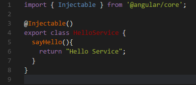
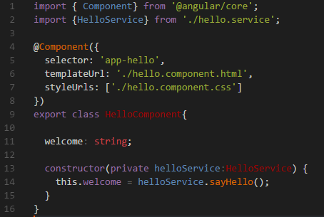
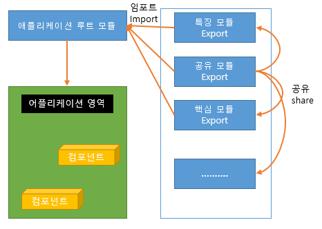
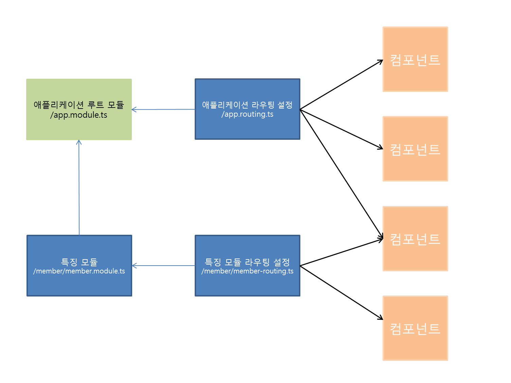
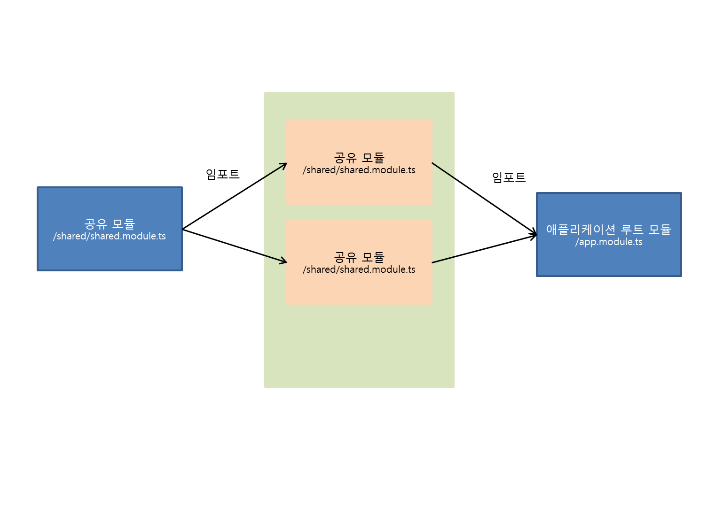

### 5.2 서비스 사용하기
#### 5.2.1 Hello 서비스
> AngularCLI를 이용해서 서비스를 추가한다.  
ng g service Hello 


> HelloService는 @Injectable 장식자를 추가한 글래스이다.  
@Injectable이 의미하는 바는 주입가능 한 클래스라는 뜻이다.   
장식자가 있으면  주입해야할 서비스 라는 것을 쉽게 알수있고   
생략했을때 일반클래스라고 오인할수있다.



#### 5.2.2 객체지향 서비스
> 객체지향 서비스는 객체지향적으로 서비스를 구성하는 서비스이다.
+ `ex) parent.service.ts`
+ `ex) child.service.ts`
+ `ex) oop.component.ts`

#### 5.2.3 목 객체 서비스
> 목 객체는 서버 의존성 없이 데이터를 제공하기 위해 가짜 데이터를 정의한 객체이다.  
목 객체를 사용하는 이유는 개발 과정에서 서버 의존성과 같은 외부 의존성을 제거함으로써 테스트를 가능하게 하기 위함이다.
+ `ex) user.ts`
+ `ex) mock-user.ts`
+ `ex) mock.service.ts`
+ `ex) mock.component.ts`

#### 5.2.4 프로미스 서비스
> 프로미스는 비동기 코드를 사용할 때 콜백 헬과 같은 비정상적인 호출 형태를 개성하기위해 나온방법이다.
+ `ex) user.ts`
+ `ex) mock-user.ts`
+ `ex) mock.service.ts`
+ `ex) list.component.ts`
+ `ex) promise.component.ts`

#### 5.2.5 서비스를 통한 데이터 교환
> 서비스는 컴포넌트 간 상호작용을 위한 매개자로 이용될 수있다.  
서비스는 두컴포넌트 간에 데이터를 교환하는 중간 매개자 역할을 한다.  
핵심은 부모 컴포넌트에는 제공자 설정을 통해 주입을 하고   
자식 컴포넌트에서는 제공자 설정을 하지 않고 곧바로 서비스를 받아서 사용하면 같은 서비스를 통해 값을 공유 할수있다.
+ `ex) shared.service.ts`
+ `ex) car.component.ts`
+ `ex) taxi.component.ts`
+ `ex) car-parent.component.ts`

## 6 모듈
### 6.1 모듈소개
#### 6.1.1 모듈이란?
> Angular 애플리케이션은 많은 모듈로 구성되어 있다.  
Angular가 제공하는 모듈은 라이브러리 모듈이라고 한다.  
라이브러리 모듈 <https://angular.io/docs/ts/latest/api/>  
패키지중 특정 모듈을 불러오려면 다음과 같이한다.
```
import { Component } from '@angular/core'
```
> 사용자 정의 모듈은 지시자와 같이 장식자를 이용한 모듈과 서비스와 함수, 값과 같이 장식자가 없는 모듈이있다.
```
export class Message(){
    sayHello(){
        return "Hello";
    }
}

class District{
    id:number; name:string;
}

export var DISTRICT:District[]=[
    {id:1,name:'서울'},{id:2,name:'부산'}{id:3,name:'대구'}
];

export function echo(mdg:string) {
    return msg;
}
```  

> 외부로 공개설정된 모듈 임포트
```
import { Message, echo, DISTRICT } from './hello.module'
```

#### 6.1.2 모듈성과 Angualr모듈
> 모듈성이란 애플리케이션의 성능을 향상시킬 수 있도록 모듈 간 결합은 최소화 하고,  
모듈 내부의 응집도는 최대화 하는 것을 의미한다.  
애플리케이션의 규모가 커질수록 모듈관리에 따르는 비용이 증가하기때문에 모듈을  
그룹 단위로 관리하는 것이 필요하다.



### 6.2 애플리케이션 루트 모듈
>애플리케이션 루트 모듈은 애플리케이션의 최상위에 존재하는 모듈
#### 6.2.1 애플리케이션 루트 모듈 선언
>애플리케이션 루트 모듈은 애플리케이션 레벨의 서비스, 컴포넌트,  
지시자, 파이프를 선언하거나 특징모듈이라고 하는 다른 하위 모듈 설정을 포함한다.  

+ Angular애플리케이션은 최소 하나 이상의 모듈 클래스를 갖는다.  
이떄 항상 애플리케이션 루트 모듈은 정의되어 있어야한다.  
+ 애플리케이션 루트 모듈은 @NgModule장식자를 이용하여 정의한다.
    + 선언자(declarations) : 애플리케이션 레벨에서 사용할 컴포넌트, 지시자, 파이프를 선언한다.
    + 호출자(imports) : Angular라이브러리모듈, 라우팅 모듈을 등록한다.
    + 제공자(providers) : 전역에서 사용할 서비스를 등록한다.
    + 부트스트랩(bootstrap) : 최상위 컴포넌트(애플리케이션 컴포넌트)를 등록한다.
```
  @NgModule({
    imports : [],
    declarations : [],
    providers : [],
    bootstrap : []
  })
```
#### 6.2.2 핵심 모듈
>애플리케이션 루트 모듈에 한번 설정함으로써 전역에서 사용할수 있는 모듈  
ex) 타이틀 컴포넌트

### 6.3
#### 6.3.1 하위 모듈의 필요성
>모듈 구성의 복잡도, 충돌등을 방지하기 위함  

+ 특징모듈 : 하위로 분리하는 모듈
    + 비슷한 모듈을 묶어서 상위 모듈에 제공
        + ex) 유틸리티 모듈, 라우팅 관련 모듈, 파이프 모듈

#### 6.3.2 특징 모듈에 선언할 구성요소 추가



>특징모듈의 구성요소  
하이라이트 지시자, 

+ 하이라이트 지시자  
    + 하이라이트 기능을 제공

#### 6.3.4 특징 모듈에 공유 모듈 설정



>애플리케이션 루트 모듈은 특징모듈을 임포트하고, 특징 모듈은 공유 모듈을 임포트한다.  
+ 특징모듈은 공유모듈을 이용해 모듈 선언을 간소화 한다.
+ 공유 모듈은 특징 모듈에서 자주 사용하는 모듈을 분리하여 선언하고 특징 모듈은 모듈에서 고유의 특징이 될만한 모듈만 추가하여 사용한다.

#### 6.3.5 게으른 모듈 로딩
>애플리케이션이 시작되는 시점이 아닌, 사용자가 URL요청을 하는 시점에 모듈을 비동기적으로 불러오는 방식
```
{path : 'lazy', loadChildren : 'app/player/player.module#PlayerModule'}
```
loadChildren 속성에 설정한 정보대로 게으른 모듈이 동작한다.


#### 7.3 가드
> 가드는 라우팅 시 접근을 제어하는 방법으로 그 종류는
+ CanActive 가드
+ CanActiveChild 가드
+ CanDeactivate 가드
+ Resolve 가드

CanAvtivate 가드
> 라우트 권한을 검사해 접근을 허용할지 말지를 결정
```angular2html
children: [
  {
      path: '',
      canActivate: [AuthGuard],
      component: Child2Component
  },
  ...
]
```

CanActivateChild 가드는 
> 자식 라우트에 대한 접근을 허용할지 말지를 결정

```angular2html
{
  path: 'active', component: ChildrenComponent,
  children: [{
    path: '',
    canActiveChild: [AuthGuard],
    children: [
      { path: 'child1', component: Child1Component },
      { path: 'child2', component: Child3Component },
      { path: '', component: Child1Component }
    ]
  }]
}
```

CanDeactivate 가드
> 저장되지 않은 상태를 버릴지 결정

```angular2html
{
  path: ':id',
  component: Child3Component,
  canDeactivate: [CanDeactivateGuard]
}
```

Resolve 가드
> 라우트 데이터를 가져와 컴포넌트에 제공하는 가드

```angular2html
{
  path: ':id',
  component: Child3Component,
  resolve: {
    childrenResolve: ChildrenResolve
    }
  }
```
##### 7.3.2 기본 가드 추

CanActive 가드, CanActivateChild 가드

```angular2html

@Injectable()
export class AuthGuard implements CanActivate, ... {

  canActivate(route: ActivatedRouteSnapshot, state: RouterStateSnapshot): boolean {
    let url: string = state.url;
    // return 참/거짓 값
  }

}
```

CanDeactivate 가드
> 현재 라우트에서 다른 라우트로 변경되어 현재 라우트가 비활화될 때 호출되는 라우트

```angular2html
@Injectable()
export class CanDeactivateGuard implements CanDeactivate<CanComponentDeactivate>{
  
  consturactor(private _router: Router) {}
  
  canDeactivate() {
  return window.confirm("저장되지 않았습니다 \n 경로를 변경하시겠습니까?");
  }
}
```
> 제너릭 형을 추가합니다.  
라우트를 변경하려 한다면 확인창이 나타나면서 경로를 변경할 지 물어봅니다.  
예라고 대답한 경우엔 경로가 변경되고 아니오를 택하면 경로가 변경되지 않습니다.


Resolve 가드

> 라우트 데이터를 가져와 컴포넌트에 제공하는 가드입니다.  
라우팅되는 시점에 작성합니다

Resolve 가드
```angular2html
@Injectable
export class ChildrenREsolve implements Resolve<Children> {

  constructor(private cs: ChildrenService, private router: Router) { }
  
  resolve(route: ActivatedRouterSnapshot): Promise<Children> | boolean {
    let id = +route.params['id'];
    
    return this.cs.findById(id).then(children => {
      if (children) {
        return children;
      } else {
        this.router.navigate(['/not-found']);
        return false;
      }
    });
  }
}
```
라우팅 설정
```angular2html

{
  path: ':id',
  component: Child3Component,
  canDeactivate: [CanDeactivateGuard],
  resolve: {
    childrenResolve: ChildrenResolve
  }
}
```
ChildrenService
```angular2html
export class Children {

  constructor(public id: number, public name: string) { }
  
}
const CHILDREN = [
  new Children(1, '첫 번째 페이지'),
  new Children(2, '두 번째 페이지'),
  new Children(3, '세 번째 페이지')
];

export let childrenPromise = Promise.resolve(CHILDREN);

@Injectable()
export class ChildrenService {
  static nextId = 10;
  findById(id: number | string) {
    return childrenPromise
      .then(children => children.find(children => children.id === +id)));
  }
}
```
> CHILDREN 데이터를 기반으로 입력된 id값이 허용되는 id인지 검사   
정상적이라면 해당 children 객체를 프로미스를 통해 반환   
반환할 데이터가 없다면 null객체를 반환
