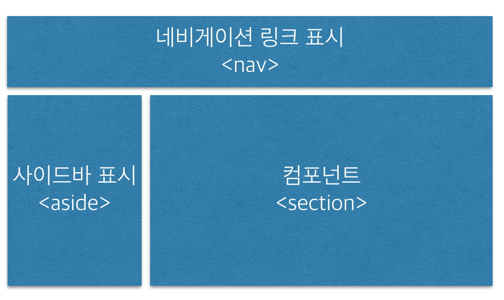
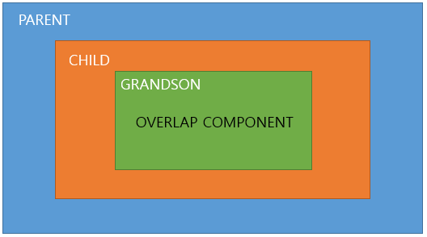

## 컴포넌트

### 1. 컴포넌트 소개
---

#### 4.1.1 웹 컴포넌트
> Angular 컴포넌트는 W3C 표준인 웹 컴포넌트 기술을 기반으로 합니다.
컴포넌트는 HTML과 CSS, 자바스크립트를 하나의 단위로 묶어주는 기술입니다.
웹 컴포넌트는 비교적 최근에 나온 기술이기 때문에 
`컴포넌트JS(webcomponent.js)`와 `폴리머(Polymer)` 같은 보완라이브러리를 사용해야 합니다.

**템플릿**
```
<template id="nav-item-template">
    <div class="nav">
        <<div class="item">메인</div>
        <<div class="item">서비스 소개</div>
        <<div class="item">서비스 특징</div>
    </div>
</template>
```
**템플릿 호출**
```
<head>
    <link rel="import" href="template.html">
    <link rel="import" href="template2.html">
    <link rel="import" href="template3.html">
</head>
```
**템플릿 사용**
```
<script>
    var link = document.querySelector('link[rel="import"]');
    var content = link.import;
    var el = content.querySelector('#template');
    document.body.appendChild(el.cloneNode(true));
</script>
```

##### 쉐도우 DOM
> 웹 페이지는 기본적으로 `문서 DOM`과 `쉐도우 DOM`을 갖습니다.
쉐도우 DOM은 문서 DOM과 분리되어 존재하기 때문에, 
문서 DOM에서 정의한 스타일이나 이벤트가 적용되지 않고 캡슐화 됩니다.

##### 커스텀 엘리먼트
> 엘리먼트 이름을 임의로 정의해서 만든 엘리먼트
`<hello-button></hello-button>`
과 같은 형태로 사용합니다.

> hello-button 엘리먼트는 모양이 없고 기능도 없는 빈 엘리먼트 입니다.
그러나 실제로 hello-button 엘리먼트는 내부적으로 다음과 같이 모양이나 이벤트를 추가함으로써
독립 컴포넌트로 정의할 수 있습니다.


```
<!doctype html>
<head>
    <script>
        var proto = Object.create(HTMLElement.prototype);
        proto.createdCallback = function() {
            var shadow = this.createShadowRoot();
            var button = document.createElement('button');
            button.className = 'btn';
            button.innerHTML = 'hello 버튼';
            button.style.fontStyle = "20px";
            shadow.appendchild(button);
            button.addEventListener('click', function(e) {
                alert("클릭했습니다.");           
            });
        }
        document.registerElement('hello-button', {
            prototype: proto
        });
    </script>
</head>
<body>
    <hello-button></hello-button>
</body>
</html>
```
**알 수 있는 사실**
+ 엘리먼트의 이름은 임의로 추가 가능
+ 커스템 엘리먼트는 기능과 모양이 합쳐진 화면 구성요소

##### 웹 컴포넌트와 Angular 컴포넌트
+ Angular의 템플릿은 웹 컴포넌트 기술의 템플릿 기술을 이용합니다.
+ Angular에서 템플릿 호출 기능은 웹 컴포넌트의 호출 기술을 이용합니다.
+ Angular컴포넌트는 쉐도우 DOM을 사용해 문서 트리에 영향을 받지 않습니다.
+ Angular컴포넌트 엘리먼트의 이름은 웹 컴포넌트의 커스텀 엘리먼트 기술을 이용합니다.

#### 4.1.2 블록 구조에서 컴포넌트로 전환

> 시맨틱 엘리먼트가 의미적으로 영역을 구분했듯이. Angular는 컴포넌트로 구조를 잡으면서 웹 애플리케이션을 만듭니다.

#### 4.1.3 Angular 컴포넌트

> Angular는 컴포넌트 부모가 자식을 포함하는 중첩 컴포넌트를 만들어 사용합니다.
컴포넌트는 하나의 화면을 나타내며, 하나의 웹 페이지는 여러 컴포넌트로 구성되어 하나의 화면을 만듭니다.
컴포넌트의 사용법은 다음과 같습니다.
```
@Component({
    // 컴포넌트 메타데이터 작성
})
export class MyComponent {
    // 컴포넌트 로직 작성
}
```
> 컴포넌트는 고유의 내부 관심사에 해당하는 로직을 작성
컴포넌트는 단일 책임 원칙 (single responsibility priciple)을 지키도록 설계

---
### 2. 컴포넌트 구조
> 컴포넌트는 크게 세 영역으로 나뉩니다.
+ import 영역
+ @Component Annotation
+ 컴포넌트 클래스 영역

#### 4.2.1 import 영역
> Angular 라이브러리 모듈을 호출하거나 사용자 모듈을 호출합니다.
```
import { Component } from '@angular/core';          // Angular 라이브러리 모듈
import { LoggerService } from './logger.service';   // 커스텀 모듈
```

#### 4.2.2 컴포넌트 Annotation 영역
> 컴포넌트와 관련된 설정 정보를 입력할 수 있습니다.

```
@Component({
    selector: 'intro-component',
    template: '<div>App Hello</div>',
    styles:['div{background: blue;}']
})
export class AppHello {}
```

##### selector
컴포넌트 이름을 정의합니다. <intro-component></intro-component> 로 사용합니다.

##### template
+ template: 내부 파일에 HTML과 템플릿 문법을 이용해 템플릿을 정의합니다.
+ templateUrl: 외부 파일에 HTML과 템플릿 문법을 이용해 템플릿을 정의합니다.
```
template: `
<div>Hello Angular Study<div>
`
```
```
templateUrl: 'AppHello.component.html',
```


##### 컴포넌트 클래스 영역
+ styles: 템플릿에 대한 스타일을 현재 파일 내부에 정의합니다.
+ stylesUrls: 템플릿에 대한 스타일을 외부 CSS 파일에 정의합니다.

```
styles:[`
    div{
        background: blue;
    }
    p {
        background: LightYellow;
    }

`]
```
```
styleUrls:['./AppHello.component.css']
```

#### 4.2.3 컴포넌트 클래스 영역
> 템플릿 데이터 출력과 관련된 로직을 처리합니다.

+ 외부에 정의된 HTTP 서비스를 이용해 HTTP 요청 결과를 받아 템플릿에 데이터를 반영하는 로직
+ 템플릿으로부터 클릭 이벤트를 받아 클릭 이벤트에 대한 처리를 수행하는 로직
+ 템플릿에 사용할 데이터를 다른 컴포넌트로부터 전달받아 이를 처리하는 로직
+ 바인딩 변수를 이용해 권한에 따라 템플릿에서 화면 제어를 담당하는 로직

> 외에도 필요에 따라 다양한 로직을 추가할 수 있습니다.
대부분 템플릿과 관련된 로직입니다.
---
### 3. 컴포넌트 기초 실습

4. 컴포넌트 간 상호작용  
    4.1 중첩 컴포넌트  
    > 컴포넌트는 포함 관계에 따라 계층 구조를 가진다.  
    한 컴포넌트가 여러 자식 컴포넌트를 포함하고 있다면 중첩 컴포넌트가 된다.
    

    4.2 Input 장식자를 이용한 값 받기
    > 부모 컴포넌트가 자식 컴포넌트로 값을 보내면 자식 컴포넌트는 값을 전달 받기위해 @Input 장식자를 이용한다.
    @Input 장식자는 외부에서 전달된 값을 받기 위해 사용하는 장식자이다.  

    4.3 EventEmitter를 이용한 값 전달
    > 부모 컴포넌트로 값을 전달하려면 @Ouptput 장식자로 선언한 변수를 EventEmitter로 초기화한다.
    그리고 부모에게 보낼 시점이 되면 emit() 메서드를 사용해 부모로 이벤트를 전달한다.

5. 자식 엘리먼트의 호출과 탐색  
    5.1 ViewChild를 이용한 엘리먼트 상태얻기
    > @ViewChild 장식자는 화면 DOM에 접근해 첫 번째로 위치한 지시자의 내부 상태나 정보를 가져온다.
    여기서 상태는 지시자의 속성 값을 말하며, 내부 정보는 컴포넌트 지시자의 경우 내부 메서드에 해당한다.

    5.2 ViewChildren을 이용해 그룹 상태 얻기
    > @ViewChil는 하나의 엘리먼트 상태를 취했던 것에 반해 @ViewChildren은 여러 지시자의 상태를 한번에 취할 수 있는 방법을 제공한다.

    5.3 ContentChild를 이용해 상태 얻기
    > @ContentChild 장식자는 콘텐츠 DOM을 탐새개해 지시자 엘리먼트의 상태를 QueryList에 담는 역할을 한다.

    5.4 ContentChildren을 이용해 그룹 값 얻기
    > @ContentChildren 장식자는 컴포넌트 내부에 위치한 엘리먼트나 지시자에 정보를 담고 있는 쿼리 리스트를 얻는다.
    쿼리 리스트 형태이기 떄문에 하나의 지시자 정보가 아닌 여러 지시자 정보를 모두 관리한다.

6. 컴포넌트 스타일
    6.1 컴포넌트 스타일  
    ```  
        선택자 {속성:값....}  
        span {background-color : #fff}
    ```
    ```
        @Component({
            selector : 'app-component',
            template : `<span>Hello</span>`,
            styles : ['span {font-style : italic;font-size:50px;}']
        })

        export class AppComponent{}
    ```  

    6.2 쉐도우 DOM 스타일  
    > 컴포넌트는 DOM선택자와 달리 독립적이므로 쉐도우 DOM접근에 사용할 쉐도우 DOM 선택자가 필요하다.  
    
    + host 선택자 &nbsp;&nbsp;&nbsp;&nbsp;&nbsp;&nbsp;&nbsp;&nbsp;&nbsp;&nbsp;&nbsp;&nbsp;&nbsp;&nbsp;&nbsp;&nbsp; :host &nbsp;&nbsp;&nbsp;&nbsp;&nbsp;&nbsp;&nbsp;&nbsp;&nbsp;&nbsp;&nbsp;&nbsp;&nbsp;&nbsp;&nbsp;&nbsp;&nbsp;&nbsp; 현재 모든 컴포넌트에 대해 쉐도우 DOM을 선택
    + host-context 선택자 &nbsp;&nbsp;&nbsp; :host-context &nbsp;&nbsp;&nbsp;&nbsp; 템플릿 외부 엘리먼트의 클래스 조건에 따라 현재 컴포넌트의 엘리먼트를 선택
    + deep 선택자 &nbsp;&nbsp;&nbsp;&nbsp;&nbsp;&nbsp;&nbsp;&nbsp;&nbsp;&nbsp;&nbsp;&nbsp;&nbsp;&nbsp;&nbsp;&nbsp; /deep/ &nbsp;&nbsp;&nbsp;&nbsp;&nbsp;&nbsp;&nbsp;&nbsp;&nbsp;&nbsp;&nbsp;&nbsp;&nbsp;&nbsp; 자식 컴포넌트에 속한 엘리먼트를 선택
      
    > :host 선택자
    
    ```
        :host {/*css 정의*/}
        :host(클래스명){/*css 정의*/}
    ```

    > :host-context 선택자

    ```
        :host-context(클래스명){/*css 정의*/}
    ```

### 서비스  

5.1 서비스 소개  
+ 5.1.1 AngularJS의 서비스  
    + 서비스 & 팩토리
    ```
        app.service('MyService',function(){
            this.sayHello = function(){
                console.log('hello');
            };
        });
    ```
    ```
        app.factory('MyService',function(){
            return {
                sayHello : function(){
                console.log('hello');  
                };
            };
        });
    ```
+ 5.1.2 Angular2에서 서비스의 역할
    + 애플리케이션 관심사와 개별 컴포넌트 관심사의 분리
        >모든 컴포넌트에 공통적으로 존재할 수 있는 공통 관심 기능을 서비스로 만든다.  
        컴포넌트 내부에서 중복되고 반복되는 코드를 서비스로 이관하는 작업이 필요함.

    + 컴포넌트 중간에서 데이터 중개자의 역할을 수행
        >컴포넌트는 내부 응집성을 가져야함.  

    + 관심사 분리를 가능하게 함
    + 재사용성 향상    

